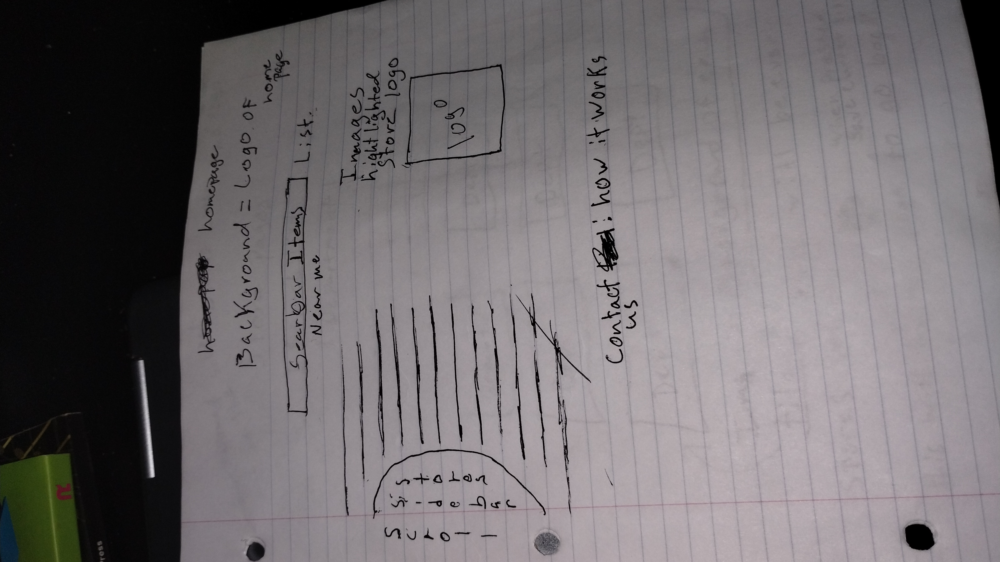
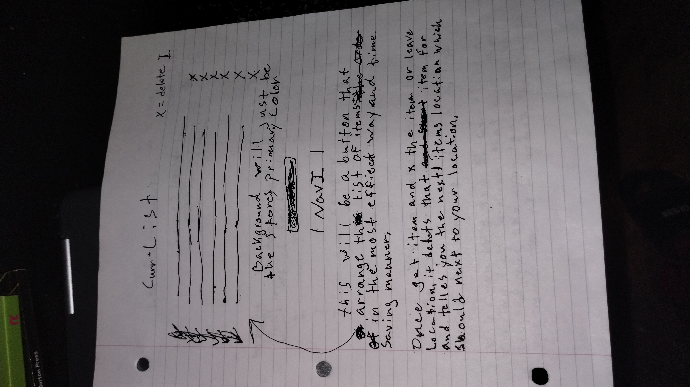
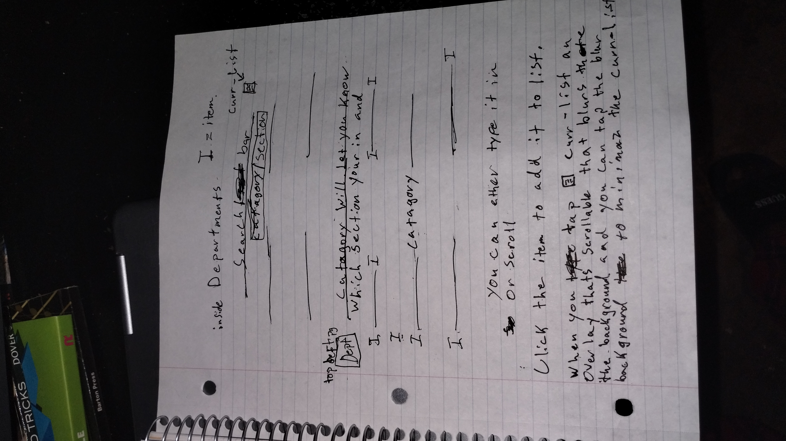
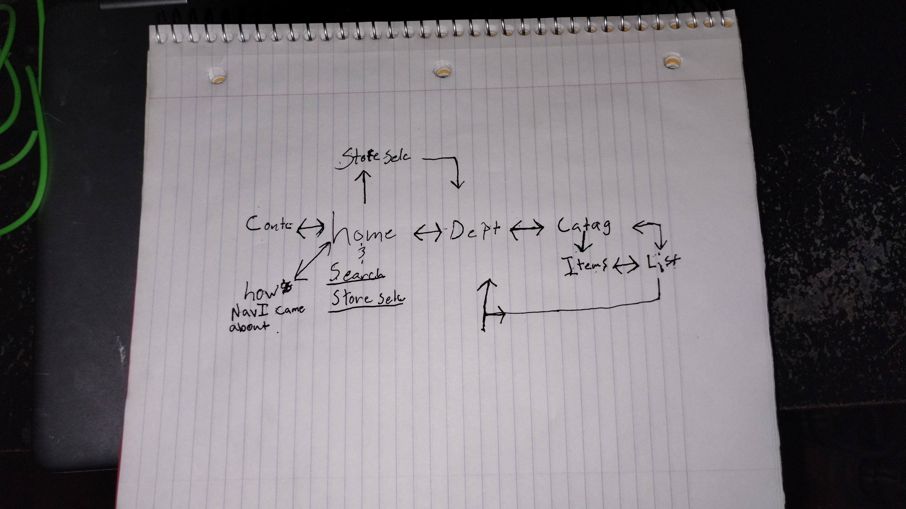
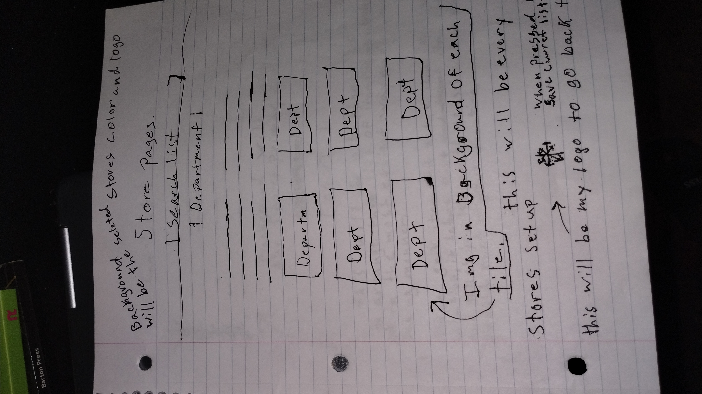

# *Capstone, Story Map, Researched Site/Apps*
---

### **What It Does**
The application is made to make Shopping in high volume stores more efficient. It takes a persons made list and reorganize list(in any order) and put it in a order based of proximity based of where you are Standing in the store. the application is most effective when started outside the store, this is because it will be able to suggest which entrance to use(for those Stores with multiple entrances) to best optimize your time.

### **Who is it for?**
The app is for anyone to use but is targeted at people who need to go shopping but are short on time. People who prefer time management above all else. The shoppers would'nt bother or ask anyone anything if they don't have to. People who end up overspending due to aimlessly searching the store. As well as people who travel a lot and are unfamiliar with where they are but still need to shop.

## Story Map Link
[Story Map](https://app.mural.co/t/savvycoders1817/m/savvycoders1817/1733789526139/e2826d9d585b016bab15dfcd64471e9bcd996ebc?sender=u5e52d88c6cddb96b9a979208)
---
---
## SWOT
___
### **Strengths**
* Easy to use
* Locates Items quicker as well proximity mapping
* No advertisements to sidetrack you
* multiple stores in one place
* can be used for both shoppers and Stocking for workers
### **Weaknesses**
* Cant Purchase in application
* Cant use store points
* doesn't show if an item isn't in Stock
### **opportunities**
* Unique not many like it
* Id like to have it show Item availability
* I plan to add more stores and or malls to the list
### **Threats**
* The main threat would be if the stores started implementing item tracking
* If Stores started to correspond each other
* Contract rules that say they cant be used in the same hub as there competitors
___
## References links
[Walmart](https://www.walmart.com/?clickid=X-q1EYTMixyKTl5SXCWebQk9UkCXGQ1vP1E13E0&irgwc=1&sourceid=imp_X-q1EYTMixyKTl5SXCWebQk9UkCXGQ1vP1E13E0&veh=aff&wmlspartner=imp_1934383&affiliates_ad_id=565706&campaign_id=9383&sharedid=72186&gclid=Cj0KCQiAvP-6BhDyARIsAJ3uv7auo94ONvTZShJ4pF0Cx3Zec83J6uZ5Q-jLHxNo4pceoyqG6HuZiXAaAuILEALw_wcB)
* I liked the site's set up
* but doesn't tell what aisle number

[Home Depot](https://www.homedepot.com/c/gift-cards?mtc=SEM-BF-CDP-GGL-NA-NA-NA-Multi-NA-PMAX-NA-NA-NA-NA-BT2-NA-NA-NA-THD_GiftCards&cm_mmc=SEM-BF-CDP-GGL-NA-NA-NA-Multi-NA-PMAX-NA-NA-NA-NA-BT2-NA-NA-NA-THD_GiftCards-21959355290--&gad_source=1&gclid=Cj0KCQiAvP-6BhDyARIsAJ3uv7aec3UaCvswh9BmSWA5ySdoZwqBDwRZW06MXfnFQYtQftrpmMKSm5MaAv8YEALw_wcB&gclsrc=aw.ds)
* Site is nice looking
* no aisle number just department

[Schnucks](https://schnucks.com/schnucks-delivers?gad_source=1&%25243p=a_google_adwords&%2524always_deeplink=false&~ad_set_id=151937041892&~campaign_id=19782568307&~channel=g&~keyword=schnucks%2520grocery%2520shopping&~placement=&gclid=CjwKCAiA9vS6BhA9EiwAJpnXw3CyUiyDXSvBjuPrtGtI0v3q5RKVlCte4M7zz8uCGLcfvDiu11FmVhoCMIwQAvD_BwE&_branch_match_id=1396466503180062446)
* Same as the other Two
* no aisle number listed
___
## Wireframe

## Digit Wireframe

